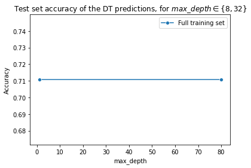

# Assignment 3: Train Decision Trees After Data Preparation


```python
import pandas as pd
import numpy as np
import os 
import matplotlib.pyplot as plt
import seaborn as sns

from sklearn.model_selection import train_test_split 
from sklearn.preprocessing import OneHotEncoder 
from sklearn.tree import DecisionTreeClassifier
from sklearn.metrics import accuracy_score
```

In this assignment, you will practice the fourth step of the machine learning life cycle and train machine learning models that will be used to solve a classification problem. Namely, you will train decision tree classifiers. You will complete the following tasks:

1. Build your DataFrame and define your ML problem:
    * Load the "cell2cell" data set into a DataFrame
    * Define the label - what are you predicting?
2. Prepare your data:
    * Handle missing data 
    * Perform feature engineering by converting categorical features to one-hot encoded values
    * Identify features
3. Create labeled examples from the data set
4. Split the data into training and test data sets
5. Train two models and evaluate their performances:
    * Fit two Decision Tree classifiers to the training data using different hyperparameter values per classifier
    * Evaluate the accuracy of both model's predictions
    * Plot the resulting accuracy scores
6. Analysis:
   * Experiment with different hyperparameter values: train multiple decision tree classifiers using different hyperparameter values and compare the accuracy scores to find which configuration yields the best performing model.
  

## Part 1. Build Your DataFrame and Define Your ML Problem

#### Load a Data Set and Save it as a Pandas DataFrame

We will work with the "cell2celltrain" data set. This version of the data set will need data preparation before it can be used for modeling.


```python
# Do not remove or edit the line below:
filename = os.path.join(os.getcwd(), "data", "cell2celltrain.csv")
```

**Task**: Load the data and save it to DataFrame `df`.


```python
df = pd.read_csv(filename)
```

####  Inspect the Data

**Task**: Display the shape of `df` -- that is, the number of records (rows) and variables (columns)


```python
df.shape
```


    (51047, 58)


#### Define the Label

Once again, this is a binary classification problem in which we will predict customer churn. The label is the `Churn` column.

#### Identify Features

We will determine the features after we prepare our data in the section below.

## Part 2. Prepare Your Data

You will perform step three of the machine learning life cycle and prepare your data for modeling. You will first clean your data by handling missing values and will then perform feature engineering by transforming categorical features using one-hot encoding.

### a. Identify and Handle Missing Data

**Task**: Check if Dataframe `df` contains missing values, and sum up the resulting values by columns. Save this sum to variable `nan_count`. Print the results.


```python
nan_count = np.sum(df.isnull(), axis = 0)
nan_count
```


    CustomerID                       0
    Churn                            0
    ServiceArea                     24
    ChildrenInHH                     0
    HandsetRefurbished               0
    HandsetWebCapable                0
    TruckOwner                       0
    RVOwner                          0
    HomeownershipKnown               0
    BuysViaMailOrder                 0
    RespondsToMailOffers             0
    OptOutMailings                   0
    NonUSTravel                      0
    OwnsComputer                     0
    HasCreditCard                    0
    NewCellphoneUser                 0
    NotNewCellphoneUser              0
    OwnsMotorcycle                   0
    MadeCallToRetentionTeam          0
    CreditRating                     0
    PrizmCode                        0
    Occupation                       0
    Married                      19700
    MonthlyRevenue                   0
    MonthlyMinutes                   0
    TotalRecurringCharge             0
    DirectorAssistedCalls            0
    OverageMinutes                   0
    RoamingCalls                     0
    PercChangeMinutes                0
    PercChangeRevenues               0
    DroppedCalls                     0
    BlockedCalls                     0
    UnansweredCalls                  0
    CustomerCareCalls                0
    ThreewayCalls                    0
    ReceivedCalls                    0
    OutboundCalls                    0
    InboundCalls                     0
    PeakCallsInOut                   0
    OffPeakCallsInOut                0
    DroppedBlockedCalls              0
    CallForwardingCalls              0
    CallWaitingCalls                 0
    MonthsInService                  0
    UniqueSubs                       0
    ActiveSubs                       0
    Handsets                         0
    HandsetModels                    0
    CurrentEquipmentDays             0
    AgeHH1                           0
    AgeHH2                           0
    RetentionCalls                   0
    RetentionOffersAccepted          0
    ReferralsMadeBySubscriber        0
    IncomeGroup                      0
    AdjustmentsToCreditRating        0
    HandsetPrice                     0
    dtype: int64


Notice that the `married` column contains many missing values. There are different ways to handle missing values in your data. You have practiced imputing missing values by replacing them with means. Another way to handle missing values is to remove the column that contains these values. In this case, replacing missing values in the `married` column with means doesn't quite make sense since the column contains boolean values, so let's remove the `married` column.

**Task**: Remove the `married` column from DataFrame `df`.


```python
df = df.drop('Married', axis=1)
```

The only other column that contains missing values is the `ServiceArea` column. Let's inspect the `ServiceArea` column to get an idea of what kind of values are in this column.


```python
df['ServiceArea']
```


    0        SEAPOR503
    1        PITHOM412
    2        MILMIL414
    3        PITHOM412
    4        OKCTUL918
               ...    
    51042    LAXSFN818
    51043    LAXCDG310
    51044    LAXCDG310
    51045    NEVPOW619
    51046    NEVPOW619
    Name: ServiceArea, Length: 51047, dtype: object


```python
df['ServiceArea'].dtype
```


    dtype('O')


**Task**: Note that the `ServiceArea` columns contains string data types. Replace every entry in the column `ServiceArea` that contains a `NaN` value with the string `unavailable`.


```python
df['ServiceArea'] = df['ServiceArea'].fillna('unavailable')
```

**Task**: Inspect DataFrame `df` to see the if it still has missing values by once again summing up the missing values by columns.


```python
df.isnull()
```


<div>
<style scoped>
    .dataframe tbody tr th:only-of-type {
        vertical-align: middle;
    }

    .dataframe tbody tr th {
        vertical-align: top;
    }

    .dataframe thead th {
        text-align: right;
    }
</style>
<table border="1" class="dataframe">
  <thead>
    <tr style="text-align: right;">
      <th></th>
      <th>CustomerID</th>
      <th>Churn</th>
      <th>ServiceArea</th>
      <th>ChildrenInHH</th>
      <th>HandsetRefurbished</th>
      <th>HandsetWebCapable</th>
      <th>TruckOwner</th>
      <th>RVOwner</th>
      <th>HomeownershipKnown</th>
      <th>BuysViaMailOrder</th>
      <th>...</th>
      <th>HandsetModels</th>
      <th>CurrentEquipmentDays</th>
      <th>AgeHH1</th>
      <th>AgeHH2</th>
      <th>RetentionCalls</th>
      <th>RetentionOffersAccepted</th>
      <th>ReferralsMadeBySubscriber</th>
      <th>IncomeGroup</th>
      <th>AdjustmentsToCreditRating</th>
      <th>HandsetPrice</th>
    </tr>
  </thead>
  <tbody>
    <tr>
      <th>0</th>
      <td>False</td>
      <td>False</td>
      <td>False</td>
      <td>False</td>
      <td>False</td>
      <td>False</td>
      <td>False</td>
      <td>False</td>
      <td>False</td>
      <td>False</td>
      <td>...</td>
      <td>False</td>
      <td>False</td>
      <td>False</td>
      <td>False</td>
      <td>False</td>
      <td>False</td>
      <td>False</td>
      <td>False</td>
      <td>False</td>
      <td>False</td>
    </tr>
    <tr>
      <th>1</th>
      <td>False</td>
      <td>False</td>
      <td>False</td>
      <td>False</td>
      <td>False</td>
      <td>False</td>
      <td>False</td>
      <td>False</td>
      <td>False</td>
      <td>False</td>
      <td>...</td>
      <td>False</td>
      <td>False</td>
      <td>False</td>
      <td>False</td>
      <td>False</td>
      <td>False</td>
      <td>False</td>
      <td>False</td>
      <td>False</td>
      <td>False</td>
    </tr>
    <tr>
      <th>2</th>
      <td>False</td>
      <td>False</td>
      <td>False</td>
      <td>False</td>
      <td>False</td>
      <td>False</td>
      <td>False</td>
      <td>False</td>
      <td>False</td>
      <td>False</td>
      <td>...</td>
      <td>False</td>
      <td>False</td>
      <td>False</td>
      <td>False</td>
      <td>False</td>
      <td>False</td>
      <td>False</td>
      <td>False</td>
      <td>False</td>
      <td>False</td>
    </tr>
    <tr>
      <th>3</th>
      <td>False</td>
      <td>False</td>
      <td>False</td>
      <td>False</td>
      <td>False</td>
      <td>False</td>
      <td>False</td>
      <td>False</td>
      <td>False</td>
      <td>False</td>
      <td>...</td>
      <td>False</td>
      <td>False</td>
      <td>False</td>
      <td>False</td>
      <td>False</td>
      <td>False</td>
      <td>False</td>
      <td>False</td>
      <td>False</td>
      <td>False</td>
    </tr>
    <tr>
      <th>4</th>
      <td>False</td>
      <td>False</td>
      <td>False</td>
      <td>False</td>
      <td>False</td>
      <td>False</td>
      <td>False</td>
      <td>False</td>
      <td>False</td>
      <td>False</td>
      <td>...</td>
      <td>False</td>
      <td>False</td>
      <td>False</td>
      <td>False</td>
      <td>False</td>
      <td>False</td>
      <td>False</td>
      <td>False</td>
      <td>False</td>
      <td>False</td>
    </tr>
    <tr>
      <th>...</th>
      <td>...</td>
      <td>...</td>
      <td>...</td>
      <td>...</td>
      <td>...</td>
      <td>...</td>
      <td>...</td>
      <td>...</td>
      <td>...</td>
      <td>...</td>
      <td>...</td>
      <td>...</td>
      <td>...</td>
      <td>...</td>
      <td>...</td>
      <td>...</td>
      <td>...</td>
      <td>...</td>
      <td>...</td>
      <td>...</td>
      <td>...</td>
    </tr>
    <tr>
      <th>51042</th>
      <td>False</td>
      <td>False</td>
      <td>False</td>
      <td>False</td>
      <td>False</td>
      <td>False</td>
      <td>False</td>
      <td>False</td>
      <td>False</td>
      <td>False</td>
      <td>...</td>
      <td>False</td>
      <td>False</td>
      <td>False</td>
      <td>False</td>
      <td>False</td>
      <td>False</td>
      <td>False</td>
      <td>False</td>
      <td>False</td>
      <td>False</td>
    </tr>
    <tr>
      <th>51043</th>
      <td>False</td>
      <td>False</td>
      <td>False</td>
      <td>False</td>
      <td>False</td>
      <td>False</td>
      <td>False</td>
      <td>False</td>
      <td>False</td>
      <td>False</td>
      <td>...</td>
      <td>False</td>
      <td>False</td>
      <td>False</td>
      <td>False</td>
      <td>False</td>
      <td>False</td>
      <td>False</td>
      <td>False</td>
      <td>False</td>
      <td>False</td>
    </tr>
    <tr>
      <th>51044</th>
      <td>False</td>
      <td>False</td>
      <td>False</td>
      <td>False</td>
      <td>False</td>
      <td>False</td>
      <td>False</td>
      <td>False</td>
      <td>False</td>
      <td>False</td>
      <td>...</td>
      <td>False</td>
      <td>False</td>
      <td>False</td>
      <td>False</td>
      <td>False</td>
      <td>False</td>
      <td>False</td>
      <td>False</td>
      <td>False</td>
      <td>False</td>
    </tr>
    <tr>
      <th>51045</th>
      <td>False</td>
      <td>False</td>
      <td>False</td>
      <td>False</td>
      <td>False</td>
      <td>False</td>
      <td>False</td>
      <td>False</td>
      <td>False</td>
      <td>False</td>
      <td>...</td>
      <td>False</td>
      <td>False</td>
      <td>False</td>
      <td>False</td>
      <td>False</td>
      <td>False</td>
      <td>False</td>
      <td>False</td>
      <td>False</td>
      <td>False</td>
    </tr>
    <tr>
      <th>51046</th>
      <td>False</td>
      <td>False</td>
      <td>False</td>
      <td>False</td>
      <td>False</td>
      <td>False</td>
      <td>False</td>
      <td>False</td>
      <td>False</td>
      <td>False</td>
      <td>...</td>
      <td>False</td>
      <td>False</td>
      <td>False</td>
      <td>False</td>
      <td>False</td>
      <td>False</td>
      <td>False</td>
      <td>False</td>
      <td>False</td>
      <td>False</td>
    </tr>
  </tbody>
</table>
<p>51047 rows × 57 columns</p>
</div>


### b. Perform One-Hot Encoding 

To train a decision tree model, we must first transform the string-valued categorical features into numerical boolean values using one-hot encoding.

#### Find the Columns Containing String Values


```python
df.dtypes
```


    CustomerID                     int64
    Churn                           bool
    ServiceArea                   object
    ChildrenInHH                    bool
    HandsetRefurbished              bool
    HandsetWebCapable               bool
    TruckOwner                      bool
    RVOwner                         bool
    HomeownershipKnown              bool
    BuysViaMailOrder                bool
    RespondsToMailOffers            bool
    OptOutMailings                  bool
    NonUSTravel                     bool
    OwnsComputer                    bool
    HasCreditCard                   bool
    NewCellphoneUser                bool
    NotNewCellphoneUser             bool
    OwnsMotorcycle                  bool
    MadeCallToRetentionTeam         bool
    CreditRating                  object
    PrizmCode                     object
    Occupation                    object
    MonthlyRevenue               float64
    MonthlyMinutes               float64
    TotalRecurringCharge         float64
    DirectorAssistedCalls        float64
    OverageMinutes               float64
    RoamingCalls                 float64
    PercChangeMinutes            float64
    PercChangeRevenues           float64
    DroppedCalls                 float64
    BlockedCalls                 float64
    UnansweredCalls              float64
    CustomerCareCalls            float64
    ThreewayCalls                float64
    ReceivedCalls                float64
    OutboundCalls                float64
    InboundCalls                 float64
    PeakCallsInOut               float64
    OffPeakCallsInOut            float64
    DroppedBlockedCalls          float64
    CallForwardingCalls          float64
    CallWaitingCalls             float64
    MonthsInService              float64
    UniqueSubs                   float64
    ActiveSubs                   float64
    Handsets                     float64
    HandsetModels                float64
    CurrentEquipmentDays         float64
    AgeHH1                       float64
    AgeHH2                       float64
    RetentionCalls               float64
    RetentionOffersAccepted      float64
    ReferralsMadeBySubscriber    float64
    IncomeGroup                  float64
    AdjustmentsToCreditRating    float64
    HandsetPrice                 float64
    dtype: object


**Task**: Find all of the columns whose values are of type 'object' and add the column names to a list named `to_encode`.


```python
to_encode = df.select_dtypes(include=['object']).columns.tolist()
```

Let's look at the number of unique values each column has:


```python
df[to_encode].nunique()
```


    ServiceArea     748
    CreditRating      7
    PrizmCode         4
    Occupation        8
    dtype: int64


Notice that all of the columns except for `ServiceArea` contain a small number of unique values. For these columns, it should be straightforward to use one-hot encoding to replace the column with a set of new binary columns for each unique value. 

However, `ServiceArea` contains a large number of unique values. Let's first deal with the special case of `ServiceArea`.

#### One Hot-Encoding 'ServiceArea': The Top 10 Values

Notice that column `ServiceArea` has 747 potential values. This means we would have to create 747 new binary indicator columns - one column per unique value. That is too many!

Transforming this many categorical values would slow down the computation down the line. One thing we could do is to see if some of the values in `ServiceArea` are occurring frequently. We will then one-hot encode just those frequent values. Let's one-hot encode only the top ten most frequent values in column `ServiceArea`. 

<b>Task</b>: Get the top 10 most frequent values in the `ServiceArea` column and store them in list `top_10_SA`.

<i>Hint:</i> Use Pandas `value_counts()` method to obtain the most frequently occurring values in descending order. Then use the `head()` method to obtain the top ten most frequently occuring values. Finally, extract only the column values and save them to list `top_10_SA`.


```python
top_10_SA = df['ServiceArea'].value_counts().head(10).index.tolist()
top_10_SA
```


    ['NYCBRO917',
     'HOUHOU281',
     'DALDAL214',
     'NYCMAN917',
     'APCFCH703',
     'DALFTW817',
     'SANSAN210',
     'APCSIL301',
     'SANAUS512',
     'SFROAK510']


Now that we have obtained the ten most frequent values for `ServiceArea`, let's use one-hot encoding to transform DataFrame `df` to represent these values numerically.

<b>Task</b>: Write a `for` loop that loops through every value in `top_10_SA` and creates one-hot encoded columns, titled <br>'ServiceArea' + '\_' + $<$service area value$>$'. For example, there will be a column named  `ServiceArea_DALDAL214`. 

Each of these new ten columns will have a value of either 0 or 1. 1 means that the row in question had that corresponding value present in the original `ServiceArea` column.  For example, row 47 in DataFrame `df` originally had the value `DALDAL214` in column `ServiceArea`. After one-hot encoding, row 47 will have the value of 1 in new column `ServiceArea_DALDAL214`.
    
Use the NumPy `np.where()`function  to accomplish this.


```python
for service_area in top_10_SA:
    column_name = 'ServiceArea' + service_area
    df[column_name] = np.where(df['ServiceArea'] == service_area, 1, 0)
```

<b>Task</b>: 
1. Drop the original, multi-valued `ServiceArea` column from the DataFrame `df`. 
2. Remove 'ServiceArea' from the `to_encode` list.


```python
df.drop(columns='ServiceArea', inplace=True)
if 'ServiceArea' in to_encode:
    to_encode.remove('ServiceArea')
```

Inspect DataFrame `df` and see the new columns and their values.


```python
df.columns
```


    Index(['CustomerID', 'Churn', 'ChildrenInHH', 'HandsetRefurbished',
           'HandsetWebCapable', 'TruckOwner', 'RVOwner', 'HomeownershipKnown',
           'BuysViaMailOrder', 'RespondsToMailOffers', 'OptOutMailings',
           'NonUSTravel', 'OwnsComputer', 'HasCreditCard', 'NewCellphoneUser',
           'NotNewCellphoneUser', 'OwnsMotorcycle', 'MadeCallToRetentionTeam',
           'CreditRating', 'PrizmCode', 'Occupation', 'MonthlyRevenue',
           'MonthlyMinutes', 'TotalRecurringCharge', 'DirectorAssistedCalls',
           'OverageMinutes', 'RoamingCalls', 'PercChangeMinutes',
           'PercChangeRevenues', 'DroppedCalls', 'BlockedCalls', 'UnansweredCalls',
           'CustomerCareCalls', 'ThreewayCalls', 'ReceivedCalls', 'OutboundCalls',
           'InboundCalls', 'PeakCallsInOut', 'OffPeakCallsInOut',
           'DroppedBlockedCalls', 'CallForwardingCalls', 'CallWaitingCalls',
           'MonthsInService', 'UniqueSubs', 'ActiveSubs', 'Handsets',
           'HandsetModels', 'CurrentEquipmentDays', 'AgeHH1', 'AgeHH2',
           'RetentionCalls', 'RetentionOffersAccepted',
           'ReferralsMadeBySubscriber', 'IncomeGroup', 'AdjustmentsToCreditRating',
           'HandsetPrice', 'ServiceAreaNYCBRO917', 'ServiceAreaHOUHOU281',
           'ServiceAreaDALDAL214', 'ServiceAreaNYCMAN917', 'ServiceAreaAPCFCH703',
           'ServiceAreaDALFTW817', 'ServiceAreaSANSAN210', 'ServiceAreaAPCSIL301',
           'ServiceAreaSANAUS512', 'ServiceAreaSFROAK510'],
          dtype='object')


```python
df.head()
```


<div>
<style scoped>
    .dataframe tbody tr th:only-of-type {
        vertical-align: middle;
    }

    .dataframe tbody tr th {
        vertical-align: top;
    }

    .dataframe thead th {
        text-align: right;
    }
</style>
<table border="1" class="dataframe">
  <thead>
    <tr style="text-align: right;">
      <th></th>
      <th>CustomerID</th>
      <th>Churn</th>
      <th>ChildrenInHH</th>
      <th>HandsetRefurbished</th>
      <th>HandsetWebCapable</th>
      <th>TruckOwner</th>
      <th>RVOwner</th>
      <th>HomeownershipKnown</th>
      <th>BuysViaMailOrder</th>
      <th>RespondsToMailOffers</th>
      <th>...</th>
      <th>ServiceAreaNYCBRO917</th>
      <th>ServiceAreaHOUHOU281</th>
      <th>ServiceAreaDALDAL214</th>
      <th>ServiceAreaNYCMAN917</th>
      <th>ServiceAreaAPCFCH703</th>
      <th>ServiceAreaDALFTW817</th>
      <th>ServiceAreaSANSAN210</th>
      <th>ServiceAreaAPCSIL301</th>
      <th>ServiceAreaSANAUS512</th>
      <th>ServiceAreaSFROAK510</th>
    </tr>
  </thead>
  <tbody>
    <tr>
      <th>0</th>
      <td>3000002</td>
      <td>True</td>
      <td>False</td>
      <td>False</td>
      <td>True</td>
      <td>False</td>
      <td>False</td>
      <td>True</td>
      <td>True</td>
      <td>True</td>
      <td>...</td>
      <td>0</td>
      <td>0</td>
      <td>0</td>
      <td>0</td>
      <td>0</td>
      <td>0</td>
      <td>0</td>
      <td>0</td>
      <td>0</td>
      <td>0</td>
    </tr>
    <tr>
      <th>1</th>
      <td>3000010</td>
      <td>True</td>
      <td>True</td>
      <td>False</td>
      <td>False</td>
      <td>False</td>
      <td>False</td>
      <td>True</td>
      <td>True</td>
      <td>True</td>
      <td>...</td>
      <td>0</td>
      <td>0</td>
      <td>0</td>
      <td>0</td>
      <td>0</td>
      <td>0</td>
      <td>0</td>
      <td>0</td>
      <td>0</td>
      <td>0</td>
    </tr>
    <tr>
      <th>2</th>
      <td>3000014</td>
      <td>False</td>
      <td>True</td>
      <td>False</td>
      <td>False</td>
      <td>False</td>
      <td>False</td>
      <td>False</td>
      <td>False</td>
      <td>False</td>
      <td>...</td>
      <td>0</td>
      <td>0</td>
      <td>0</td>
      <td>0</td>
      <td>0</td>
      <td>0</td>
      <td>0</td>
      <td>0</td>
      <td>0</td>
      <td>0</td>
    </tr>
    <tr>
      <th>3</th>
      <td>3000022</td>
      <td>False</td>
      <td>False</td>
      <td>False</td>
      <td>True</td>
      <td>False</td>
      <td>False</td>
      <td>True</td>
      <td>True</td>
      <td>True</td>
      <td>...</td>
      <td>0</td>
      <td>0</td>
      <td>0</td>
      <td>0</td>
      <td>0</td>
      <td>0</td>
      <td>0</td>
      <td>0</td>
      <td>0</td>
      <td>0</td>
    </tr>
    <tr>
      <th>4</th>
      <td>3000026</td>
      <td>True</td>
      <td>False</td>
      <td>False</td>
      <td>False</td>
      <td>False</td>
      <td>False</td>
      <td>True</td>
      <td>True</td>
      <td>True</td>
      <td>...</td>
      <td>0</td>
      <td>0</td>
      <td>0</td>
      <td>0</td>
      <td>0</td>
      <td>0</td>
      <td>0</td>
      <td>0</td>
      <td>0</td>
      <td>0</td>
    </tr>
  </tbody>
</table>
<p>5 rows × 66 columns</p>
</div>


Let's inspect column `ServiceArea_DALDAL214` in row 47. Remember, it should have a value of 1.


```python
df.loc[47]['ServiceAreaDALDAL214']
```


    1


#### One Hot-Encode all Remaining Columns

All other columns in `to_encode` have reasonably small numbers of unique values, so we are going to simply one-hot encode every unique value of those columns.

<b>Task</b>: In the code cell below, iterate over the column names contained in `to_encode` and one-hot encode these columns. In the loop:
  1. Use the Pandas `pd.get_dummies()` function to one-hot encode the column and save the resulting DataFrame to variable `df_encoded`
  2. Use `df.join` to join DataFrame `df_encoded` with DataFrame `df`


```python
for column in to_encode:
    df_encoded = pd.get_dummies(df[column], prefix=column)
    df = df.join(df_encoded)
    df.drop(columns=column, inplace=True)
```


```python
df.head()
```


<div>
<style scoped>
    .dataframe tbody tr th:only-of-type {
        vertical-align: middle;
    }

    .dataframe tbody tr th {
        vertical-align: top;
    }

    .dataframe thead th {
        text-align: right;
    }
</style>
<table border="1" class="dataframe">
  <thead>
    <tr style="text-align: right;">
      <th></th>
      <th>CustomerID</th>
      <th>Churn</th>
      <th>ChildrenInHH</th>
      <th>HandsetRefurbished</th>
      <th>HandsetWebCapable</th>
      <th>TruckOwner</th>
      <th>RVOwner</th>
      <th>HomeownershipKnown</th>
      <th>BuysViaMailOrder</th>
      <th>RespondsToMailOffers</th>
      <th>...</th>
      <th>PrizmCode_Suburban</th>
      <th>PrizmCode_Town</th>
      <th>Occupation_Clerical</th>
      <th>Occupation_Crafts</th>
      <th>Occupation_Homemaker</th>
      <th>Occupation_Other</th>
      <th>Occupation_Professional</th>
      <th>Occupation_Retired</th>
      <th>Occupation_Self</th>
      <th>Occupation_Student</th>
    </tr>
  </thead>
  <tbody>
    <tr>
      <th>0</th>
      <td>3000002</td>
      <td>True</td>
      <td>False</td>
      <td>False</td>
      <td>True</td>
      <td>False</td>
      <td>False</td>
      <td>True</td>
      <td>True</td>
      <td>True</td>
      <td>...</td>
      <td>1</td>
      <td>0</td>
      <td>0</td>
      <td>0</td>
      <td>0</td>
      <td>0</td>
      <td>1</td>
      <td>0</td>
      <td>0</td>
      <td>0</td>
    </tr>
    <tr>
      <th>1</th>
      <td>3000010</td>
      <td>True</td>
      <td>True</td>
      <td>False</td>
      <td>False</td>
      <td>False</td>
      <td>False</td>
      <td>True</td>
      <td>True</td>
      <td>True</td>
      <td>...</td>
      <td>1</td>
      <td>0</td>
      <td>0</td>
      <td>0</td>
      <td>0</td>
      <td>0</td>
      <td>1</td>
      <td>0</td>
      <td>0</td>
      <td>0</td>
    </tr>
    <tr>
      <th>2</th>
      <td>3000014</td>
      <td>False</td>
      <td>True</td>
      <td>False</td>
      <td>False</td>
      <td>False</td>
      <td>False</td>
      <td>False</td>
      <td>False</td>
      <td>False</td>
      <td>...</td>
      <td>0</td>
      <td>1</td>
      <td>0</td>
      <td>1</td>
      <td>0</td>
      <td>0</td>
      <td>0</td>
      <td>0</td>
      <td>0</td>
      <td>0</td>
    </tr>
    <tr>
      <th>3</th>
      <td>3000022</td>
      <td>False</td>
      <td>False</td>
      <td>False</td>
      <td>True</td>
      <td>False</td>
      <td>False</td>
      <td>True</td>
      <td>True</td>
      <td>True</td>
      <td>...</td>
      <td>0</td>
      <td>0</td>
      <td>0</td>
      <td>0</td>
      <td>0</td>
      <td>1</td>
      <td>0</td>
      <td>0</td>
      <td>0</td>
      <td>0</td>
    </tr>
    <tr>
      <th>4</th>
      <td>3000026</td>
      <td>True</td>
      <td>False</td>
      <td>False</td>
      <td>False</td>
      <td>False</td>
      <td>False</td>
      <td>True</td>
      <td>True</td>
      <td>True</td>
      <td>...</td>
      <td>0</td>
      <td>0</td>
      <td>0</td>
      <td>0</td>
      <td>0</td>
      <td>0</td>
      <td>1</td>
      <td>0</td>
      <td>0</td>
      <td>0</td>
    </tr>
  </tbody>
</table>
<p>5 rows × 82 columns</p>
</div>


<b>Task</b>: Remove all the original columns from DataFrame `df`


```python
filename = os.path.join(os.getcwd(), "data", "cell2celltrain.csv")
df1 = pd.read_csv(filename)
columns_to_drop = df1.columns.tolist()
df2 = df.drop(columns=[col for col in columns_to_drop if col in df.columns])
```

<b>Task</b>: Check that the data does not contain any missing values. The absence of missing values is necessary for training a Decision Tree model.


```python
df.isnull()
```


<div>
<style scoped>
    .dataframe tbody tr th:only-of-type {
        vertical-align: middle;
    }

    .dataframe tbody tr th {
        vertical-align: top;
    }

    .dataframe thead th {
        text-align: right;
    }
</style>
<table border="1" class="dataframe">
  <thead>
    <tr style="text-align: right;">
      <th></th>
      <th>CustomerID</th>
      <th>Churn</th>
      <th>ChildrenInHH</th>
      <th>HandsetRefurbished</th>
      <th>HandsetWebCapable</th>
      <th>TruckOwner</th>
      <th>RVOwner</th>
      <th>HomeownershipKnown</th>
      <th>BuysViaMailOrder</th>
      <th>RespondsToMailOffers</th>
      <th>...</th>
      <th>PrizmCode_Suburban</th>
      <th>PrizmCode_Town</th>
      <th>Occupation_Clerical</th>
      <th>Occupation_Crafts</th>
      <th>Occupation_Homemaker</th>
      <th>Occupation_Other</th>
      <th>Occupation_Professional</th>
      <th>Occupation_Retired</th>
      <th>Occupation_Self</th>
      <th>Occupation_Student</th>
    </tr>
  </thead>
  <tbody>
    <tr>
      <th>0</th>
      <td>False</td>
      <td>False</td>
      <td>False</td>
      <td>False</td>
      <td>False</td>
      <td>False</td>
      <td>False</td>
      <td>False</td>
      <td>False</td>
      <td>False</td>
      <td>...</td>
      <td>False</td>
      <td>False</td>
      <td>False</td>
      <td>False</td>
      <td>False</td>
      <td>False</td>
      <td>False</td>
      <td>False</td>
      <td>False</td>
      <td>False</td>
    </tr>
    <tr>
      <th>1</th>
      <td>False</td>
      <td>False</td>
      <td>False</td>
      <td>False</td>
      <td>False</td>
      <td>False</td>
      <td>False</td>
      <td>False</td>
      <td>False</td>
      <td>False</td>
      <td>...</td>
      <td>False</td>
      <td>False</td>
      <td>False</td>
      <td>False</td>
      <td>False</td>
      <td>False</td>
      <td>False</td>
      <td>False</td>
      <td>False</td>
      <td>False</td>
    </tr>
    <tr>
      <th>2</th>
      <td>False</td>
      <td>False</td>
      <td>False</td>
      <td>False</td>
      <td>False</td>
      <td>False</td>
      <td>False</td>
      <td>False</td>
      <td>False</td>
      <td>False</td>
      <td>...</td>
      <td>False</td>
      <td>False</td>
      <td>False</td>
      <td>False</td>
      <td>False</td>
      <td>False</td>
      <td>False</td>
      <td>False</td>
      <td>False</td>
      <td>False</td>
    </tr>
    <tr>
      <th>3</th>
      <td>False</td>
      <td>False</td>
      <td>False</td>
      <td>False</td>
      <td>False</td>
      <td>False</td>
      <td>False</td>
      <td>False</td>
      <td>False</td>
      <td>False</td>
      <td>...</td>
      <td>False</td>
      <td>False</td>
      <td>False</td>
      <td>False</td>
      <td>False</td>
      <td>False</td>
      <td>False</td>
      <td>False</td>
      <td>False</td>
      <td>False</td>
    </tr>
    <tr>
      <th>4</th>
      <td>False</td>
      <td>False</td>
      <td>False</td>
      <td>False</td>
      <td>False</td>
      <td>False</td>
      <td>False</td>
      <td>False</td>
      <td>False</td>
      <td>False</td>
      <td>...</td>
      <td>False</td>
      <td>False</td>
      <td>False</td>
      <td>False</td>
      <td>False</td>
      <td>False</td>
      <td>False</td>
      <td>False</td>
      <td>False</td>
      <td>False</td>
    </tr>
    <tr>
      <th>...</th>
      <td>...</td>
      <td>...</td>
      <td>...</td>
      <td>...</td>
      <td>...</td>
      <td>...</td>
      <td>...</td>
      <td>...</td>
      <td>...</td>
      <td>...</td>
      <td>...</td>
      <td>...</td>
      <td>...</td>
      <td>...</td>
      <td>...</td>
      <td>...</td>
      <td>...</td>
      <td>...</td>
      <td>...</td>
      <td>...</td>
      <td>...</td>
    </tr>
    <tr>
      <th>51042</th>
      <td>False</td>
      <td>False</td>
      <td>False</td>
      <td>False</td>
      <td>False</td>
      <td>False</td>
      <td>False</td>
      <td>False</td>
      <td>False</td>
      <td>False</td>
      <td>...</td>
      <td>False</td>
      <td>False</td>
      <td>False</td>
      <td>False</td>
      <td>False</td>
      <td>False</td>
      <td>False</td>
      <td>False</td>
      <td>False</td>
      <td>False</td>
    </tr>
    <tr>
      <th>51043</th>
      <td>False</td>
      <td>False</td>
      <td>False</td>
      <td>False</td>
      <td>False</td>
      <td>False</td>
      <td>False</td>
      <td>False</td>
      <td>False</td>
      <td>False</td>
      <td>...</td>
      <td>False</td>
      <td>False</td>
      <td>False</td>
      <td>False</td>
      <td>False</td>
      <td>False</td>
      <td>False</td>
      <td>False</td>
      <td>False</td>
      <td>False</td>
    </tr>
    <tr>
      <th>51044</th>
      <td>False</td>
      <td>False</td>
      <td>False</td>
      <td>False</td>
      <td>False</td>
      <td>False</td>
      <td>False</td>
      <td>False</td>
      <td>False</td>
      <td>False</td>
      <td>...</td>
      <td>False</td>
      <td>False</td>
      <td>False</td>
      <td>False</td>
      <td>False</td>
      <td>False</td>
      <td>False</td>
      <td>False</td>
      <td>False</td>
      <td>False</td>
    </tr>
    <tr>
      <th>51045</th>
      <td>False</td>
      <td>False</td>
      <td>False</td>
      <td>False</td>
      <td>False</td>
      <td>False</td>
      <td>False</td>
      <td>False</td>
      <td>False</td>
      <td>False</td>
      <td>...</td>
      <td>False</td>
      <td>False</td>
      <td>False</td>
      <td>False</td>
      <td>False</td>
      <td>False</td>
      <td>False</td>
      <td>False</td>
      <td>False</td>
      <td>False</td>
    </tr>
    <tr>
      <th>51046</th>
      <td>False</td>
      <td>False</td>
      <td>False</td>
      <td>False</td>
      <td>False</td>
      <td>False</td>
      <td>False</td>
      <td>False</td>
      <td>False</td>
      <td>False</td>
      <td>...</td>
      <td>False</td>
      <td>False</td>
      <td>False</td>
      <td>False</td>
      <td>False</td>
      <td>False</td>
      <td>False</td>
      <td>False</td>
      <td>False</td>
      <td>False</td>
    </tr>
  </tbody>
</table>
<p>51047 rows × 82 columns</p>
</div>


#### Identify Features
Let's inspect the transformed DataFrame `df`. These will be our features.


```python
list(df.loc[:, df.columns != 'Churn'])
```


    ['CustomerID',
     'ChildrenInHH',
     'HandsetRefurbished',
     'HandsetWebCapable',
     'TruckOwner',
     'RVOwner',
     'HomeownershipKnown',
     'BuysViaMailOrder',
     'RespondsToMailOffers',
     'OptOutMailings',
     'NonUSTravel',
     'OwnsComputer',
     'HasCreditCard',
     'NewCellphoneUser',
     'NotNewCellphoneUser',
     'OwnsMotorcycle',
     'MadeCallToRetentionTeam',
     'MonthlyRevenue',
     'MonthlyMinutes',
     'TotalRecurringCharge',
     'DirectorAssistedCalls',
     'OverageMinutes',
     'RoamingCalls',
     'PercChangeMinutes',
     'PercChangeRevenues',
     'DroppedCalls',
     'BlockedCalls',
     'UnansweredCalls',
     'CustomerCareCalls',
     'ThreewayCalls',
     'ReceivedCalls',
     'OutboundCalls',
     'InboundCalls',
     'PeakCallsInOut',
     'OffPeakCallsInOut',
     'DroppedBlockedCalls',
     'CallForwardingCalls',
     'CallWaitingCalls',
     'MonthsInService',
     'UniqueSubs',
     'ActiveSubs',
     'Handsets',
     'HandsetModels',
     'CurrentEquipmentDays',
     'AgeHH1',
     'AgeHH2',
     'RetentionCalls',
     'RetentionOffersAccepted',
     'ReferralsMadeBySubscriber',
     'IncomeGroup',
     'AdjustmentsToCreditRating',
     'HandsetPrice',
     'ServiceAreaNYCBRO917',
     'ServiceAreaHOUHOU281',
     'ServiceAreaDALDAL214',
     'ServiceAreaNYCMAN917',
     'ServiceAreaAPCFCH703',
     'ServiceAreaDALFTW817',
     'ServiceAreaSANSAN210',
     'ServiceAreaAPCSIL301',
     'ServiceAreaSANAUS512',
     'ServiceAreaSFROAK510',
     'CreditRating_1-Highest',
     'CreditRating_2-High',
     'CreditRating_3-Good',
     'CreditRating_4-Medium',
     'CreditRating_5-Low',
     'CreditRating_6-VeryLow',
     'CreditRating_7-Lowest',
     'PrizmCode_Other',
     'PrizmCode_Rural',
     'PrizmCode_Suburban',
     'PrizmCode_Town',
     'Occupation_Clerical',
     'Occupation_Crafts',
     'Occupation_Homemaker',
     'Occupation_Other',
     'Occupation_Professional',
     'Occupation_Retired',
     'Occupation_Self',
     'Occupation_Student']


## Part 3. Create Labeled Examples from the Data Set 

<b>Task</b>: Create labeled examples from DataFrame `df`. 
In the code cell below carry out the following steps:

* Get the `Churn` column from DataFrame `df` and assign it to the variable `y`. This will be our label.
* Get all other columns from DataFrame `df` and assign them to the variable `X`. These will be our features. 


```python
y = df['Churn']
X = df.loc[:, df.columns != 'Churn']
```

## Part 4.  Create Training and Test Data Sets

<b>Task</b>: In the code cell below create training and test data sets out of the labeled examples. 

1. Use Scikit-learn's `train_test_split()` function to create the data sets.

2. Specify:
    * A test set that is 30 percent (.30) of the size of the data set.
    * A seed value of '123'. 
    


```python
X_train, X_test, y_train, y_test = train_test_split(X,y,test_size=0.30,random_state=123)
```

Check that the dimensions of the training and test data sets are what you expected:


```python
print(X_train.shape)
print(X_test.shape)
```

    (35732, 81)
    (15315, 81)


## Part 5. Train Decision Tree Classifiers and Evaluate Their Performances

The code cell below contains a shell of a function named `train_test_DT()`. This function should 
1. train a Decision Tree classifier on the training data
2. test the resulting model on the test data
3. compute and return the accuracy score of the resulting predicted class labels on the test data

<b>Task:</b> Complete the function to make it work.


```python
def train_test_DT(X_train, X_test, y_train, y_test, depth, leaf=1, crit='entropy'):
    '''
    Fit a Decision Tree classifier to the training data X_train, y_train.
    Return the accuracy of resulting predictions on the test set.
    Parameters:
        depth := The maximum depth of the tree
        leaf := The minimum number of samples required to be at a leaf node. 
            We have assigned a default value of 1 to the leaf parameter
        crit := The function to be used to measure the quality of a split. 
            We have assigned a default value of 'entropy' to the crit parameter. Note that
            scikit-learn's default value is gini.
    '''
    
     # 1. Create the  Scikit-learn DecisionTreeClassifier model object below and assign to 
        # variable 'model'
    model = DecisionTreeClassifier(max_depth=depth, min_samples_leaf=leaf, criterion=crit)
    
  

    # 2. Fit the model to the training data below
    model.fit(X_train,y_train)
   

    # 3. Make predictions on the test data and assign the result to the 
        # variable 'class_label_predictions' below
    class_label_predictions = model.predict(X_test)
   
  
    # 4. Compute the accuracy and save the result to the variable 'acc_score' below
    acc_score = accuracy_score(y_test, class_label_predictions)
          
    
    return acc_score
```

#### Train Decision Tree Classifiers Using Different Hyperparameter Values

<b>Task:</b> Complete the code cell below to train two Decision Tree classifiers using your function. Save the resulting accuracy scores to the list `acc`.

Choose the two values for max depth to pass as arguments to your function:
- one with a low value of max depth
- one high value of max depth

Print the max depth and resulting accuracy score.


```python
depth1= 1 
depth2 = 80 

max_depth_range = [depth1, depth2]
acc = []

for md in max_depth_range:
    score = train_test_DT(X_train, X_test, y_train, y_test, 1, md)
    print('Max Depth=' + str(md) + ', accuracy score: ' + str(score))
    acc.append(float(score))
```

    Max Depth=1, accuracy score: 0.7107411034933072
    Max Depth=80, accuracy score: 0.7107411034933072


<b>Task</b>: Visualize the results using a `seaborn` lineplot. The x axis should correspond to the depths contained in list `max_depth_range` and the y axis should corrsponds to the accuracy scores contained in the list `acc`.

Consult the online [documentation](https://seaborn.pydata.org/generated/seaborn.lineplot.html) for more information about `seaborn` lineplots.


```python
fig = plt.figure()
ax = fig.add_subplot(111)

p = sns.lineplot(x=max_depth_range, y=acc, marker='o', label = 'Full training set')

plt.title('Test set accuracy of the DT predictions, for $max\_depth\in\{8, 32\}$')
ax.set_xlabel('max_depth')
ax.set_ylabel('Accuracy')
plt.show()
```





## Part 6. Analysis

Experiment with different values for `max_depth`. Add these new values to the list `max_depth_range`, retrain your models and rerun with the visualization cell above. Compare the different accuracy scores.

Once you find the best value for `max_depth`, experiment with different values for `leaf` and compare the different accuracy scores.

Is there one model configuration that yields the best score? Record your findings in the cell below.

I noticed that when I experimented with different levels of max_depths I found that my model retained the same level of accuracies and when I experimented with different leaf sizes it still retained the same accuracy score.
